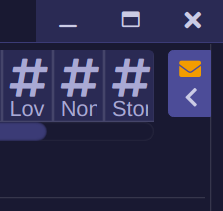
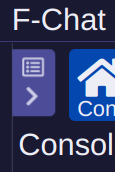
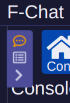



# Narrow Design
Frolic features improvements to the default slim-style design. To use the slim design, simply shrink the width of the application and the sidebars will collapse, letting you focus on your conversation.

## Improvements
Frolic's improvements include notifications about activity normally visible in the sidebars.

### Note and Message Notifications
Since the website note & message notification is now placed at the bottom of the right sidebar, there's no way to see if you have new messages or notes on the website. To remedy this, we now have an icon display on the pull-out tab of the bar. The icon will display one of three icons for new messages, new notes, or new messages & notes.

### New Mention Alerts
To pair with the notification message, there's another icon on the left sidebar that shows you new alerts regarding your messages - it will display a different icon for receiving new channel messages or private messages. When you get mentioned, it will brighten the icon to make it more noticable.
  
