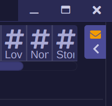



# Note Display
F-Chat Rising introduced a feature that checks the website for new notes and messages every 15 minutes. Frolic moves this notice from a popup that covers the typing box into the right sidebar, beneath the member list, friend list, or profile view.

## Functionality
Functionality has been improved by allowing the player to specifically request a refresh of note & message status via a refresh button.

### Collapsed Sidebar
If you use a narrow screen, the note & message notification will be hidden. To accomodate players who prefer a narrow application, the note status is also displayed in the pull-out tab:

