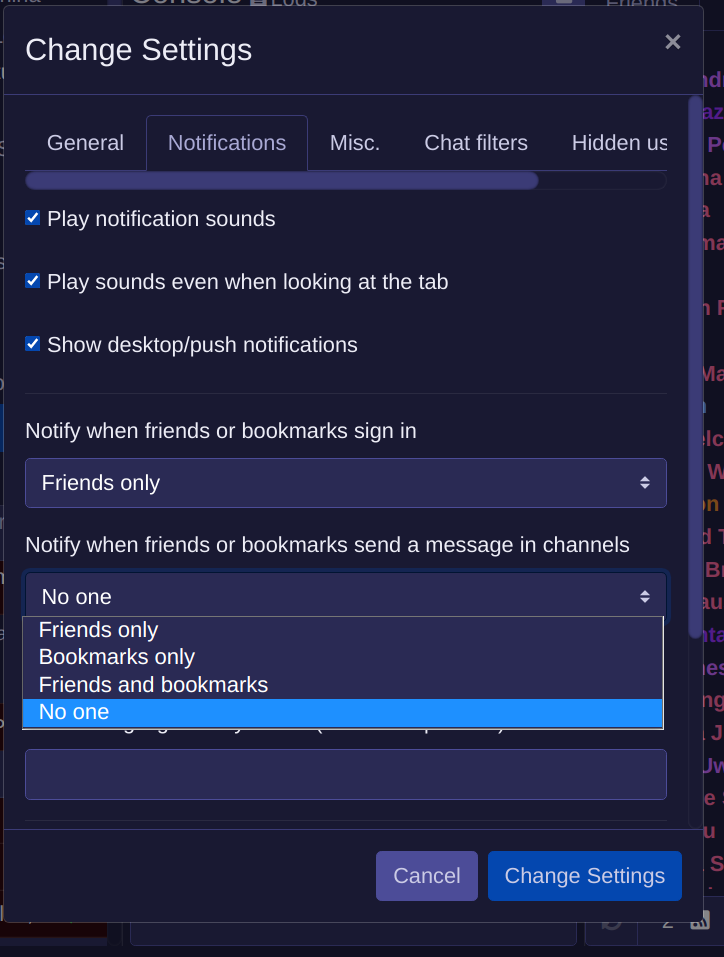
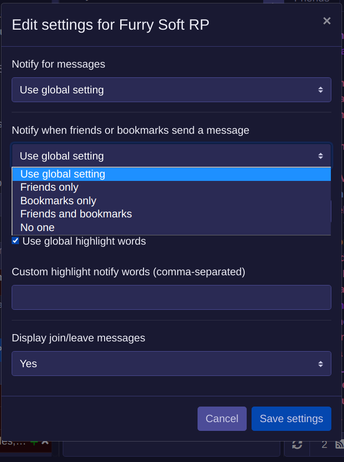

# Notifications
Frolic lets you know when your friends or bookmarks are active in your rooms. You can enable or disable this feature globally or on a per-room basis.

## Global Setting
You can enable this option globally in the primary settings menu:

## Per-room Setting
You may also enable (or disable) this setting for a single room, so you don't need to get constantly pinged when they're active in a particular room you don't want to pay attention to:

