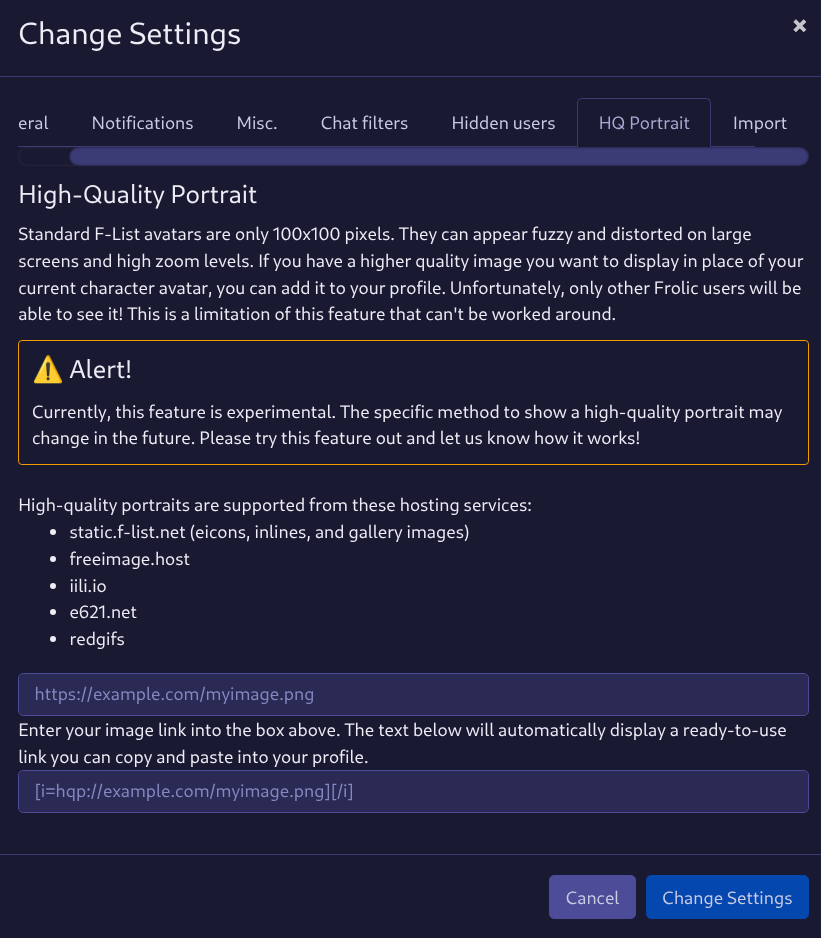

# ⚠ Experimental
This feature continues to be under development. Please provide feedback to the issue tracker if you experience any unusual behavior.

# High Quality Portraits
A feature called "high quality portraits" has existed in Frolic without much documentation. This features allows you substitute your avatar with a higher resolution image from an external hosting service. This is useful because F-List avatars can only be 100x100 pixels, which does not meet today's standards.

## Modern
Starting in Frolic 0.7.8, a modern revision of this feature blossomed into being. The modern way of using a high quality portrait is to hide a text block in your profile that contains your image link. The text will be completely hidden, but Frolic will still be able to read it and render it.

To make it easy, there's a tab in the settings that will take your link and give you some ready-to-use text you can paste into your profile.

If you want to add a link manually, the format is important and it looks like this: `[i=hqp://iili.io/FL9Uolt.png][/i]`. Having the closing tag (`[/i]`) immediately following isn't necessary; you can add your `hqp://` link to any italics tag already on your profile.

## Limitations
Only Frolic users (and other custom clients that support this protocol) will detect and use your high-quality portrait. Your high quality portrait won't be displayed in the vanilla F-Chat 3.0 app or on the F-List website.

Only a select number of image hosting services are supported. Some websites can host malicious files, therefore we only  allow hosting services when we can vet them. Thankfully, f-list images (like those publicly visible in your gallery) are supported, so you can put your high quality image in your gallery and it will work.

Only links that resolve into images can be used, so make sure you're using a link that ends in `.png` or another image extension.

These are the hosting services that can host your high-quality portrait:
  * static.f-list.net (images in your character gallery)
  * freeimage.host (and iili.io)
  * redgifs.com
  * e621.net

## Legacy
Previously, the way to gain a high quality portrait required marking your profile with visible text. You would add `[url=https://iili.io/FL9Uolt.png]Rising Portrait[/url]` and thus, everyone would see that you use a custom chat client. This is highly undesirable as it turns you into a walking advertisement and in doing so, breaks the voice and narrative of your profile.
